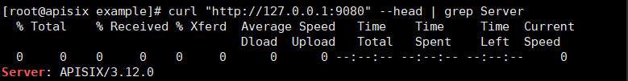

# apisix网关使用指南

# 一、商品链接

[apisix网关](https://marketplace.huaweicloud.com/contents/ab5930b5-64ce-4bfd-88bc-325f38b18fcc#productid=OFFI113658900)

# 二、商品说明

Apache APISIX 是 Apache 软件基金会下的顶级项目。它是一个具有动态、实时、高性能等特点的云原生 API 网关。该产品基于鲲鹏服务器和华为云 EulerOS 2.0 64bit 系统，提供开箱即用的apisix网关。

# 三、商品购买
您可以在云商店搜索 **apisix网关**。

其中，地域、规格、推荐配置使用默认，购买方式根据您的需求选择按需/按月/按年，短期使用推荐按需，长期使用推荐按月/按年，确认配置后点击“立即购买”。


## 3.1 使用 RFS 模板直接部署

必填项填写后，点击 下一步


创建直接计划后，点击 确定


点击部署，执行计划

如下图“Apply required resource success. ”即为资源创建完成

# 3.2ECS 控制台配置

### 准备工作

在使用ECS控制台配置前，需要您提前配置好 **安全组规则**。

> **安全组规则的配置如下：**
- 入方向规则放通端口9080,9081,9082,2379，源地址内必须包含您的客户端ip，否则无法访问
- 入方向规则放通 CloudShell 连接实例使用的端口 `22`，以便在控制台登录调试
- 出方向规则一键放通

### 创建ECS

前提工作准备好后，选择 ECS 控制台配置跳转到[购买ECS](https://support.huaweicloud.com/qs-ecs/ecs_01_0103.html) 页面，ECS 资源的配置如下图所示：

选择CPU架构

选择服务器规格

选择镜像

其他参数根据实际请客进行填写，填写完成之后，点击立即购买即可


> **值得注意的是：**
> - VPC 您可以自行创建
> - 安全组选择 [**准备工作**](#准备工作) 中配置的安全组；
> - 弹性公网IP选择现在购买，推荐选择“按流量计费”，带宽大小可设置为5Mbit/s；
> - 高级配置需要在高级选项支持注入自定义数据，所以登录凭证不能选择“密码”，选择创建后设置；
> - 其余默认或按规则填写即可。

# 商品使用

## APISIX网关使用

1.通过 curl 来访问正在运行的 APISIX 实例。比如，你可以发送一个简单的 HTTP 请求来验证 APISIX 运行状态是否正常：
```bash
curl "http://127.0.0.1:9080" --head | grep Server
```
如果一切顺利，将输出如下信息：
Server: APISIX/Version


2.配置路由
Apache APISIX 使用 routes 来提供灵活的网关管理功能，在一个请求中，routes 包含了访问路径和上游目标等信息。

本示例将引导你创建一个 route 并验证它，你可以参考以下步骤：

创建一个指向 httpbin.org的 upstream。

使用 cURL 发送一个请求，了解 APISIX 的代理和转发请求机制。

你可以创建一个路由，将客户端的请求转发至 httpbin.org（这个网站能测试 HTTP 请求和响应的各种信息）。

通过下面的命令，你将创建一个路由，把请求http://127.0.0.1:9080/ip 转发至 httpbin.org/ip：
```bash
curl -i "http://127.0.0.1:9180/apisix/admin/routes" -X PUT \
-H 'X-API-KEY: edd1c9f034335f136f87ad84b625c8f1' \
-d  '{
"id": "getting-started-ip",
"uri": "/ip",
"upstream": {
"type": "roundrobin",
"nodes": {
"httpbin.org:80": 1
}
}
}'
```

如果配置成功，将会返回 HTTP/1.1 201 Created。
```bash
curl "http://127.0.0.1:9080/ip"
```

你将会得到类似下面的返回：
```text
{
"origin": "183.94.122.205"
}
```


### 参考文档
[apisix官方文档](https://apisix.apache.org/zh/docs/apisix/getting-started/README/)
